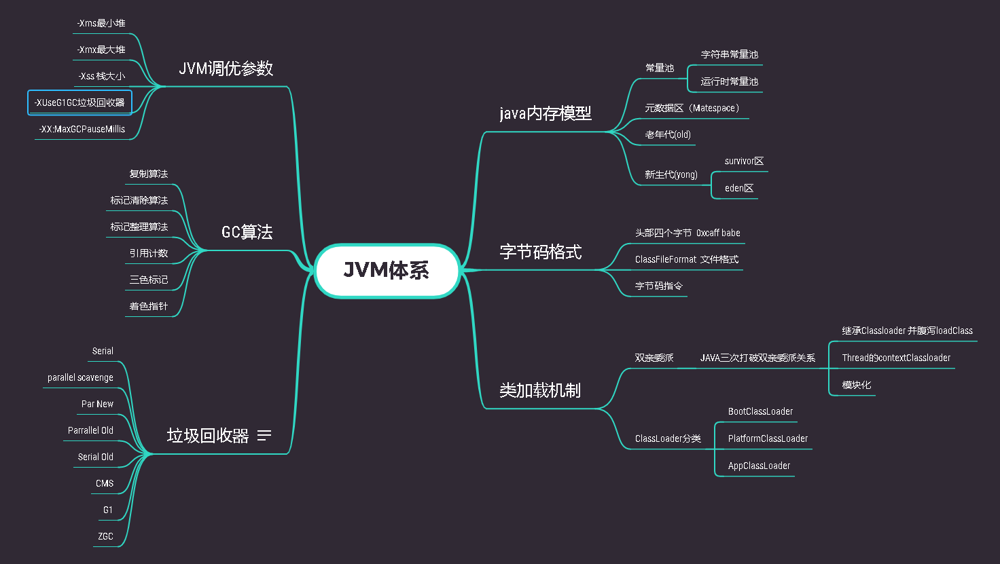

# work-experience-summary

### JVM 

1. JVM 思维导图

文章整理

[URLClassloader加载类实现原理](./JVM/doc/类加载机制/URLClassloader加载类实现原理.md)

[JVM启动调用java的main函数的流程](./JVM/doc/JVM启动/JVM启动调用java的main函数的流程.md)

2. 多线程高并发思维导图

[多线程高并发思维导图](concurrent/doc/java多线程并发.xmind)

